# Product Requirements Document (PRD)

## Kitchentory - Kitchen Inventory & Recipe Management System

### Executive Summary

Kitchentory is a mobile-optimized web application that helps users track their kitchen inventory and discover recipes based on available ingredients. The app aims to reduce food waste, simplify meal planning, and streamline grocery shopping.

### Problem Statement

Modern households face several challenges:

- **Inventory Blindness**: Forgetting 
- what groceries are already at home
- **Food Waste**: Items expiring due to lack of visibility
- **Recipe Paralysis**: Not knowing what to cook with available ingredients
- **Inefficient Shopping**: Buying duplicates or missing essential items
- **Time Constraints**: Need for quick, efficient kitchen management

### Product Vision

Create an intuitive, mobile-first solution that transforms kitchen management from a chore into an effortless, intelligent system that saves time, money, and reduces food waste.

### Target Users

#### Primary Personas

**1. Busy Parent Sarah (35)**

- Manages household of 4
- Shops weekly at multiple stores
- Values time-saving features
- Needs meal planning assistance
- Concerned about food waste and budget

**2. College Student Mike (22)**

- Limited kitchen space and budget
- Shops irregularly
- Needs simple, quick recipes
- Shares apartment with roommates
- Tech-savvy, mobile-first user

**3. Home Chef Elena (42)**

- Extensive pantry inventory
- Experiments with diverse cuisines
- Values detailed recipe management
- Hosts dinner parties regularly
- Wants inspiration from existing ingredients

#### Secondary Personas

- Senior citizens needing simplified interfaces
- Professional couples with dual shopping habits
- Health-conscious individuals tracking nutrition

### Core Features

#### 1. Inventory Management

**Quick Add Methods**

- Barcode scanning via mobile camera
- Voice input for hands-free adding
- Receipt scanning (future enhancement)
- Manual search with autocomplete
- Bulk import from shopping lists

**Organization & Tracking**

- Auto-categorization (Produce, Dairy, Meat, Pantry, etc.)
- Location tracking (Fridge, Freezer, Pantry, Counter)
- Expiration date monitoring with smart alerts
- Quantity tracking with multiple unit support
- Custom tags and notes
- Product images (auto-fetched or user-uploaded)

**Inventory Intelligence**

- Low stock alerts based on consumption patterns
- Expiration notifications (customizable timing)
- Seasonal item suggestions
- Storage tips for different products

#### 2. Recipe Discovery & Management

**Smart Matching Engine**

- "Cook Now" - Recipes using only available ingredients
- "Almost There" - Recipes missing 1-3 ingredients
- Ingredient substitution suggestions
- Leftover utilization recommendations

**Recipe Features**

- Filter by dietary restrictions (vegan, gluten-free, etc.)
- Cooking time and difficulty levels
- Cuisine type categorization
- Nutritional information display
- User ratings and reviews
- Recipe collections and meal planning

**Cooking Experience**

- Step-by-step cooking mode
- Ingredient check-off with inventory depletion
- Timer integration
- Serving size adjustment
- Shopping list generation for missing items

#### 3. Shopping Intelligence

**Smart Lists**

- Auto-generation based on depleted items
- Recipe-based shopping lists
- Recurring item predictions
- Store-specific list organization
- Budget tracking and estimates

**Collaboration**

- Share lists with household members via Clerk user management
- Real-time sync across devices using Convex subscriptions
- Assignment of items to shoppers with live updates
- Instant check-off notifications via Convex reactivity

**Future Enhancements**

- Store price comparisons
- Digital coupon integration
- Delivery service integration

### Technical Requirements

#### Platform Requirements

- Mobile-optimized responsive web design using Next.js 14+ App Router
- Progressive Web App (PWA) capabilities via Next.js PWA plugin
- Real-time data synchronization with Convex database
- Cross-browser compatibility (Chrome, Safari, Firefox)
- Server-side rendering (SSR) and static generation (SSG) for optimal performance

#### UI/UX Architecture with shadcn/ui

##### Component System Design
- **Design System**: shadcn/ui components with custom Kitchentory design tokens
- **Accessibility**: WCAG 2.1 AA compliance via Radix UI primitives
- **Theming**: CSS variables with light/dark mode support
- **Typography**: Inter font family with custom font scales
- **Color System**: HSL-based color palette with semantic tokens

##### Component Architecture

```mermaid
graph TD
    subgraph "shadcn/ui Foundation"
        Radix[🎛️ Radix UI Primitives<br/>Accessible base components]
        Tailwind[🎨 TailwindCSS<br/>Utility-first styling]
        CVA[🔧 Class Variance Authority<br/>Component variants]
    end
    
    subgraph "Custom Components"
        Kitchen[🍳 Kitchen Components<br/>Inventory, Recipe Cards]
        Forms[📝 Form Components<br/>Input, Select, Validation]
        Layout[🏗️ Layout Components<br/>Navigation, Sidebar]
        Feedback[💬 Feedback Components<br/>Toasts, Modals, Alerts]
    end
    
    subgraph "Composition Layer"
        Pages[📄 Page Compositions<br/>Full page layouts]
        Features[⚡ Feature Modules<br/>Complete workflows]
    end
    
    Radix --> Kitchen
    Tailwind --> Kitchen
    CVA --> Kitchen
    
    Radix --> Forms
    Tailwind --> Forms
    CVA --> Forms
    
    Kitchen --> Pages
    Forms --> Pages
    Layout --> Pages
    Feedback --> Pages
    
    Pages --> Features
    
    style Radix fill:#e8eaf6
    style Kitchen fill:#e8f5e8
    style Pages fill:#e3f2fd
```


##### Design Token System
```typescript
// design-tokens.ts
export const tokens = {
  colors: {
    // Brand colors for Kitchentory
    brand: {
      primary: 'hsl(142, 76%, 36%)', // Fresh green
      secondary: 'hsl(39, 100%, 57%)', // Warm amber
      accent: 'hsl(210, 40%, 98%)', // Light blue-gray
    },
    // Semantic colors
    semantic: {
      success: 'hsl(120, 100%, 25%)', // Added successfully
      warning: 'hsl(38, 92%, 50%)', // Expiring soon
      danger: 'hsl(0, 84%, 60%)', // Expired items
      info: 'hsl(217, 91%, 60%)', // General info
    },
    // Context-specific colors
    inventory: {
      fresh: 'hsl(120, 100%, 25%)',
      expiring: 'hsl(38, 92%, 50%)',
      expired: 'hsl(0, 84%, 60%)',
    }
  },
  spacing: {
    // Kitchen-specific spacing
    item: '0.75rem', // Space between inventory items
    card: '1rem', // Padding inside cards
    section: '1.5rem', // Between major sections
  },
  typography: {
    // Readable text scales for recipes
    recipe: {
      title: '1.5rem',
      ingredient: '0.875rem',
      instruction: '1rem',
    }
  }
}
```

##### Responsive Design Strategy
- **Mobile-First**: Design starts at 320px width
- **Breakpoints**: sm(640px), md(768px), lg(1024px), xl(1280px)
- **Touch Targets**: Minimum 44px for interactive elements
- **Gesture Support**: Swipe actions for item management
- **Keyboard Navigation**: Full keyboard accessibility

#### Performance Requirements

- Page load time < 2 seconds with Next.js optimizations
- Real-time updates < 500ms via Convex subscriptions
- Search autocomplete < 200ms with Convex queries
- Smooth animations at 60fps using Framer Motion
- Optimistic UI updates for instant feedback

#### Security & Privacy

- Secure authentication via Clerk with multi-factor authentication
- GDPR compliance with built-in data protection
- Secure session management and JWT tokens
- Real-time data encryption in transit and at rest
- Automated security updates and monitoring

### Real-Time Capabilities & Sync Architecture

#### Convex Real-Time Features

##### Reactive Data Layer
- **Live Queries**: Automatic UI updates when underlying data changes
- **Optimistic Updates**: Instant feedback with server reconciliation
- **Conflict Resolution**: Automatic merge strategies for concurrent edits
- **Subscription Management**: Efficient re-subscription handling

##### Multi-User Collaboration Patterns


##### Real-Time Use Cases
1. **Inventory Updates**: Item additions/removals sync instantly across devices
2. **Shopping Lists**: Real-time item checking/unchecking for family members
3. **Recipe Cooking**: Live ingredient consumption tracking during cooking
4. **Expiration Alerts**: Immediate notifications when items near expiration
5. **Collaboration Indicators**: Show who's currently editing what

#### Performance Optimization Strategies

##### Client-Side Optimizations
- **Subscription Batching**: Group related subscriptions for efficiency
- **Query Debouncing**: Prevent excessive re-queries during rapid updates
- **Local State Management**: Cache frequently accessed data client-side
- **Progressive Loading**: Load data incrementally as needed

##### Network Efficiency
- **Delta Updates**: Send only changed fields, not entire documents
- **Connection Pooling**: Reuse WebSocket connections across tabs
- **Offline Queueing**: Store mutations locally when offline, sync when online
- **Smart Reconnection**: Exponential backoff with jitter for connection recovery

#### Data Synchronization Patterns

##### Offline-First Architecture


##### Conflict Resolution Strategies
1. **Last-Writer-Wins**: Simple timestamp-based resolution
2. **Operational Transform**: Merge concurrent text edits
3. **User-Mediated**: Present conflicts for manual resolution
4. **Field-Level Merging**: Automatic merge of non-conflicting fields

### System Architecture

#### High-Level Architecture (C4 Model - Level 1)

```mermaid
graph TB
    User[👤 Users<br/>Mobile/Desktop] --> PWA[🔧 Kitchentory PWA<br/>Next.js App Router]
    PWA --> Edge[🌐 Vercel Edge Network]
    Edge --> Functions[⚡ Serverless Functions<br/>Next.js API Routes]
    Functions --> Convex[💾 Convex Database<br/>Real-time Backend]
    Functions --> Clerk[🔐 Clerk Auth<br/>User Management]
    Functions --> External[🌍 External APIs<br/>Barcode/Recipe Data]
    
    style User fill:#e1f5fe
    style PWA fill:#f3e5f5
    style Edge fill:#e8f5e8
    style Functions fill:#fff3e0
    style Convex fill:#fce4ec
    style Clerk fill:#f1f8e9
    style External fill:#f5f5f5
```



#### Container Architecture (C4 Model - Level 2)

```mermaid
graph TB
    subgraph "Client Layer"
        PWA[📱 PWA Application<br/>Next.js 14 + TypeScript]
        Components[🧩 UI Components<br/>shadcn/ui + Radix]
        Cache[💾 Client Cache<br/>React Query + IndexedDB]
    end
    
    subgraph "Edge Layer"
        CDN[🌐 Vercel CDN<br/>Static Assets]
        Middleware[⚙️ Next.js Middleware<br/>Auth/Routing]
        ISR[🔄 ISR Cache<br/>Incremental Static]
    end
    
    subgraph "API Layer"
        Routes[🛤️ API Routes<br/>App Router Handlers]
        Webhooks[🔗 Webhooks<br/>Clerk/External Events]
        Actions[⚡ Server Actions<br/>Form Handling]
    end
    
    subgraph "Backend Services"
        Convex[💿 Convex Backend<br/>Database + Functions]
        Clerk[🔐 Clerk Platform<br/>Auth + Subscriptions]
        External[📡 External APIs<br/>UPC/Recipe Services]
    end
    
    PWA --> CDN
    PWA --> Routes
    Components --> Cache
    Routes --> Convex
    Routes --> Clerk
    Middleware --> Clerk
    Webhooks --> Convex
    
    style PWA fill:#e3f2fd
    style Components fill:#f3e5f5
    style Convex fill:#fce4ec
    style Clerk fill:#f1f8e9
```



#### Component Architecture (C4 Model - Level 3)

```mermaid
graph TB
    subgraph "Frontend Components"
        Layout[🏗️ Layout Components<br/>App Shell + Navigation]
        Inventory[📦 Inventory Module<br/>CRUD + Scanning]
        Recipes[👨‍🍳 Recipe Module<br/>Discovery + Cooking]
        Shopping[🛒 Shopping Module<br/>Lists + Collaboration]
        Auth[🔑 Auth Module<br/>Login + Profile]
    end
    
    subgraph "Shared Services"
        RT[⚡ Real-time Client<br/>Convex Subscriptions]
        State[📊 State Management<br/>Zustand + React Query]
        Utils[🛠️ Utilities<br/>Validation + Formatting]
    end
    
    subgraph "Backend Functions"
        Mutations[✏️ Convex Mutations<br/>Data Writes]
        Queries[🔍 Convex Queries<br/>Data Reads]
        Actions[🎬 Convex Actions<br/>External API Calls]
        Crons[⏰ Scheduled Jobs<br/>Cleanup + Notifications]
    end
    
    Inventory --> RT
    Recipes --> RT
    Shopping --> RT
    RT --> Queries
    RT --> Mutations
    State --> RT
    Actions --> External[📡 External APIs]
    
    style Layout fill:#e8eaf6
    style RT fill:#e0f2f1
    style Mutations fill:#fff3e0
```



### Data Flow Architecture

#### Real-Time Data Synchronization


#### Recipe Matching Engine Flow


#### Authentication & Authorization Flow


### Deployment Architecture

#### Vercel Edge Deployment

```mermaid
graph TB
    subgraph "Global Edge Network"
        Edge1[🌍 US East<br/>Primary Region]
        Edge2[🌍 US West<br/>Edge Functions]
        Edge3[🌍 Europe<br/>Edge Functions]
        Edge4[🌍 Asia<br/>Edge Functions]
    end
    
    subgraph "Core Services"
        Vercel[▲ Vercel Platform<br/>Orchestration]
        Functions[⚡ Serverless Functions<br/>Node.js Runtime]
        Static[📄 Static Assets<br/>CDN Distribution]
    end
    
    subgraph "Backend Services"
        Convex[💾 Convex Cloud<br/>Global Distribution]
        Clerk[🔐 Clerk Global<br/>Multi-region Auth]
    end
    
    subgraph "Monitoring"
        Analytics[📊 Vercel Analytics<br/>Performance Metrics]
        Sentry[🐛 Sentry<br/>Error Tracking]
        Logs[📝 Vercel Logs<br/>Function Monitoring]
    end
    
    Edge1 --> Vercel
    Edge2 --> Vercel
    Edge3 --> Vercel
    Edge4 --> Vercel
    
    Vercel --> Functions
    Vercel --> Static
    Functions --> Convex
    Functions --> Clerk
    
    Vercel --> Analytics
    Functions --> Sentry
    Functions --> Logs
    
    style Edge1 fill:#e3f2fd
    style Convex fill:#fce4ec
    style Clerk fill:#f1f8e9
    style Analytics fill:#e8f5e8
```



#### CI/CD Pipeline

```mermaid
graph LR
    Dev[👨‍💻 Developer] --> Git[📚 Git Repository]
    Git --> Vercel[▲ Vercel Platform]
    
    subgraph "Build Process"
        Build[🔨 Next.js Build<br/>TypeScript Check]
        Test[🧪 Test Suite<br/>Jest + Testing Library]
        Lint[✅ ESLint + Prettier<br/>Type Safety]
        Bundle[📦 Bundle Analysis<br/>Performance Check]
    end
    
    subgraph "Deployment Stages"
        Preview[🔍 Preview Deploy<br/>Feature Branches]
        Staging[🏗️ Staging Environment<br/>Integration Testing]
        Prod[🚀 Production Deploy<br/>Main Branch]
    end
    
    Vercel --> Build
    Build --> Test
    Test --> Lint
    Lint --> Bundle
    
    Bundle --> Preview
    Preview --> Staging
    Staging --> Prod
    
    style Dev fill:#e1f5fe
    style Build fill:#fff3e0
    style Prod fill:#e8f5e8
```



### TypeScript Integration Architecture

#### Type System Organization

```mermaid
graph TD
    subgraph "Type Definitions"
        Global[🌐 Global Types<br/>shared/types.ts]
        Domain[📂 Domain Types<br/>Per-feature schemas]
        API[🔗 API Types<br/>Convex generated]
        UI[🎨 UI Types<br/>Component props]
    end
    
    subgraph "Validation Layer"
        Zod[✅ Zod Schemas<br/>Runtime validation]
        Convex[🔄 Convex Validators<br/>Backend validation]
        Forms[📝 Form Schemas<br/>react-hook-form]
    end
    
    subgraph "Generated Types"
        ConvexGen[⚡ Convex Generated<br/>API contracts]
        ClerkGen[🔐 Clerk Types<br/>User management]
    end
    
    Global --> Domain
    Domain --> API
    Domain --> UI
    
    Zod --> Forms
    Zod --> Convex
    API --> ConvexGen
    UI --> ClerkGen
    
    style Global fill:#e3f2fd
    style Zod fill:#e8f5e8
    style ConvexGen fill:#fce4ec
```



### Success Metrics

#### User Engagement

- Daily Active Users (DAU)
- Items scanned per week
- Recipes cooked per month
- Shopping list completion rate

#### Business Impact

- User retention (30, 60, 90 day)
- Premium conversion rate
- User satisfaction (NPS score)
- Food waste reduction percentage

#### Technical Performance

- System uptime (99.9% target)
- API response times
- Error rates
- Mobile performance scores

### MVP Scope (Phase 1)

#### Must Have

1. User registration and authentication
2. Basic inventory CRUD operations
3. Barcode scanning for common products
4. Simple recipe matching (exact ingredients)
5. Basic shopping list generation
6. Mobile-responsive design
7. Basic categorization system

#### Nice to Have

1. Expiration tracking
2. Recipe filtering
3. Household sharing
4. Nutritional information
5. Multiple storage locations

#### Future Phases

1. Advanced recipe matching with substitutions
2. Receipt scanning
3. Voice input
4. Meal planning calendar
5. Social features (recipe sharing)
6. Third-party integrations

### Constraints & Assumptions

#### Technical Constraints

- Initial deployment on Vercel platform
- Convex free tier limitations for database operations
- Clerk authentication limits for free tier
- Single region deployment initially (expandable with Vercel Edge)

#### Business Constraints

- Bootstrap development budget
- Single developer initially
- Limited marketing budget
- Freemium model with Clerk subscription management

#### Assumptions

- Users have smartphones with cameras
- Basic technical literacy
- Internet connectivity (with offline support)
- Users willing to maintain inventory

### Risks & Mitigation

#### Technical Risks

- **Barcode API limitations**: Multiple API fallbacks with Next.js API routes
- **Convex scaling**: Monitor function execution limits and optimize queries
- **Real-time performance**: Implement efficient subscription patterns
- **Data accuracy**: User feedback and correction mechanisms with optimistic updates

#### Business Risks

- **Low user adoption**: Focus on single killer feature first
- **Competitor emergence**: Rapid iteration and user feedback
- **Monetization challenges**: Early premium feature testing

### Release Plan

#### Beta Launch (Week 10-12)

- 100 beta users
- Core features only
- Feedback collection system
- Performance monitoring

#### Public Launch (Week 13-16)

- Marketing website
- App store presence (PWA)
- Premium tier introduction
- Support system

#### Post-Launch Iterations

- Weekly feature updates
- Monthly major releases
- Quarterly strategic reviews
- Annual platform expansions

### Appendix

#### Competitive Analysis

- **Paprika**: Recipe-focused, lacks inventory
- **Pantry Check**: Inventory only, no recipes
- **BigOven**: Complex, not mobile-first
- **Kitchentory Advantage**: Seamless inventory-recipe integration

#### Modern Technology Stack

##### Frontend Architecture
- **Framework**: Next.js 14+ with App Router and React Server Components
- **Language**: TypeScript 5+ with strict mode enabled
- **UI System**: shadcn/ui components built on Radix UI primitives
- **Styling**: TailwindCSS v3+ with CSS variables and custom design tokens
- **State Management**: Zustand for client state, React Query for server state
- **Forms**: react-hook-form with Zod schema validation
- **Animation**: Framer Motion with optimized performance patterns

##### Backend & Database
- **Database**: Convex - serverless database with real-time subscriptions
- **Functions**: Convex serverless functions with TypeScript
- **Real-time**: Built-in reactive subscriptions with optimistic updates
- **File Storage**: Convex file storage for images and documents
- **Search**: Full-text search with vector similarity matching
- **Caching**: Multi-layer caching with Convex query caching

##### Authentication & Security
- **Auth Provider**: Clerk with multi-factor authentication support
- **Session Management**: JWT tokens with automatic refresh
- **User Management**: Clerk Organizations for household sharing
- **Billing**: Clerk's integrated subscription and payment processing
- **Security**: OWASP compliance, HTTPS-only, CSP headers

##### Infrastructure & Deployment
- **Hosting**: Vercel with Edge Runtime and global CDN
- **Edge Functions**: Vercel Edge Functions for geo-distributed logic
- **Static Generation**: ISR (Incremental Static Regeneration) for performance
- **Image Optimization**: Next.js Image with automatic WebP/AVIF conversion
- **PWA**: Service worker with offline-first strategies

##### Development & Monitoring
- **Build System**: Turbopack for development, SWC for production
- **Testing**: Jest + React Testing Library + Playwright E2E
- **Type Safety**: End-to-end type safety from database to UI
- **Linting**: ESLint + Prettier + TypeScript strict mode
- **Monitoring**: Vercel Analytics + Sentry for error tracking
- **Performance**: Lighthouse CI, bundle analysis, Core Web Vitals

##### Third-party Integrations
- **Barcode APIs**: Multiple providers with fallback strategies
- **Recipe APIs**: Spoonacular/Edamam with custom recipe database
- **Notifications**: Web Push API with service worker support
- **Analytics**: Privacy-focused analytics with Vercel Analytics
- **Error Tracking**: Sentry with performance monitoring

### Architecture Decision Records (ADRs)

#### ADR-001: Next.js App Router vs Pages Router
**Status**: Accepted  
**Date**: 2024-01-15

**Context**: Need to choose between Next.js App Router (new) vs Pages Router (stable)

**Decision**: Use App Router for modern React patterns and better performance

**Consequences**:
- ✅ Better performance with React Server Components
- ✅ Improved developer experience with co-located layouts
- ✅ Built-in loading and error boundaries
- ❌ Newer API with less community resources
- ❌ Some third-party libraries may need adaptation

#### ADR-002: Convex vs Traditional Database + API
**Status**: Accepted  
**Date**: 2024-01-20

**Context**: Need real-time capabilities with minimal backend complexity

**Decision**: Use Convex for database, real-time subscriptions, and serverless functions

**Consequences**:
- ✅ Built-in real-time subscriptions eliminate WebSocket complexity
- ✅ TypeScript end-to-end type safety
- ✅ No need for separate API layer or ORM
- ✅ Automatic optimistic updates
- ❌ Vendor lock-in to Convex platform
- ❌ Limited to JavaScript/TypeScript ecosystem

#### ADR-003: Clerk vs NextAuth.js vs Custom Auth
**Status**: Accepted  
**Date**: 2024-01-22

**Context**: Need authentication with subscription management capabilities

**Decision**: Use Clerk for comprehensive auth and billing integration

**Consequences**:
- ✅ Built-in subscription and billing management
- ✅ Multiple authentication methods (email, social, MFA)
- ✅ Organization support for household sharing
- ✅ Excellent developer experience and documentation
- ❌ Higher cost compared to self-hosted solutions
- ❌ Vendor dependency for critical user management

#### ADR-004: shadcn/ui vs Material-UI vs Custom Components
**Status**: Accepted  
**Date**: 2024-01-25

**Context**: Need accessible, customizable UI components for mobile-first design

**Decision**: Use shadcn/ui with Radix UI primitives and TailwindCSS

**Consequences**:
- ✅ Full component ownership with copy-paste philosophy
- ✅ Excellent accessibility via Radix UI primitives
- ✅ Highly customizable with TailwindCSS
- ✅ No runtime bundle overhead
- ❌ More initial setup compared to plug-and-play libraries
- ❌ Need to maintain component library ourselves

#### ADR-005: Zustand vs Redux Toolkit vs Context API
**Status**: Accepted  
**Date**: 2024-01-28

**Context**: Need client-side state management that works well with server state

**Decision**: Use Zustand for client state, React Query for server state

**Consequences**:
- ✅ Minimal boilerplate compared to Redux
- ✅ Great TypeScript support
- ✅ Clear separation between client and server state
- ✅ Easy testing and debugging
- ❌ Less ecosystem and tooling compared to Redux
- ❌ Team needs to learn new state management patterns

#### ADR-006: Vercel vs AWS vs Self-hosted
**Status**: Accepted  
**Date**: 2024-01-30

**Context**: Need hosting platform that integrates well with Next.js and provides global CDN

**Decision**: Use Vercel for hosting and deployment

**Consequences**:
- ✅ Seamless Next.js integration and optimizations
- ✅ Global edge network for optimal performance
- ✅ Automatic deployments from Git
- ✅ Built-in analytics and monitoring
- ❌ Higher costs at scale compared to self-hosting
- ❌ Vendor lock-in for deployment pipeline

### Component Interaction Patterns

#### Data Loading Patterns

```mermaid
graph TD
    Route[📍 App Router Page] --> Layout[🏗️ Layout Component]
    Route --> Loading[⏳ Loading Boundary]
    Route --> Error[❌ Error Boundary]
    
    Layout --> RSC[🖥️ Server Component<br/>Initial Data Fetch]
    RSC --> Client[💻 Client Component<br/>Interactive Features]
    
    Client --> Query[🔍 React Query<br/>Server State Cache]
    Client --> Store[📊 Zustand Store<br/>Client State]
    
    Query --> Convex[💾 Convex Backend<br/>Real-time Subscriptions]
    Store --> Local[💾 Local Storage<br/>User Preferences]
    
    style Route fill:#e3f2fd
    style RSC fill:#e8f5e8
    style Client fill:#f3e5f5
    style Convex fill:#fce4ec
```


#### Error Handling Strategy

```mermaid
flowchart TD
    Error[🚨 Error Occurs] --> Type{Error Type}
    
    Type -->|Network| Network[📡 Network Error Handler]
    Type -->|Validation| Validation[✅ Validation Error Handler]
    Type -->|Runtime| Runtime[⚡ Runtime Error Handler]
    Type -->|Auth| Auth[🔐 Auth Error Handler]
    
    Network --> Retry[🔄 Retry Logic]
    Network --> Offline[📱 Offline Mode]
    
    Validation --> Toast[💬 Toast Notification]
    Validation --> Form[📝 Form Field Errors]
    
    Runtime --> Sentry[🐛 Sentry Logging]
    Runtime --> Fallback[🔄 Error Boundary Fallback]
    
    Auth --> Login[🔐 Redirect to Login]
    Auth --> Refresh[🔄 Token Refresh]
    
    style Error fill:#ffebee
    style Network fill:#e8f5e8
    style Sentry fill:#fff3e0
```


#### Monetization Strategy

- Freemium model managed via Clerk subscriptions
- Premium: Unlimited items, advanced features, real-time collaboration
- Family plans with household sharing via Clerk organizations
- No ads in any tier
- Seamless payment processing through Clerk's billing integration
- Potential affiliate revenue through recipe ingredients